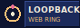

# You've been invited to the loopback webring

Someone in the ring vouched for you. That's the only way in. This file walks you
through adding your site. It takes about ten minutes.

## What this is

A webring is a loop of personal websites that link to each other in a circle. A
visitor lands on one site, clicks "next," and ends up on the next member's site,
then the next, until they loop back to where they started. No feeds, no ranking,
no tracking. Just people's own corners of the web, connected by hand.

loopback is invite-only. The ring stays small and the sites stay good because
every member had to be vouched for by someone already in it.

## Before you start

You need three things:

1. **A personal website that's actually yours.** A blog, a portfolio, a digital
   garden, a weird experiment. Not a link tree, not a company page, not a social
   profile. Something you made.
2. **The handle of the member who invited you.** You'll credit them in your entry.
   If you don't have one, you don't have an invite yet.
3. **A GitHub account** (to open a pull request).

## Step 1: Add yourself to the ring

Fork the ring's repository, then open `webring.json`. It's an ordered list. Add
your entry at the **end** of the list:

```json
{
  "name": "your-handle",
  "gh": "your-github-username",
  "url": "https://your-site.com",
  "invitedBy": "member-who-invited-you"
}
```

- **name**: a short handle, unique in the ring. It goes in your navigation links,
  so keep it simple (letters, numbers, dashes). Case doesn't matter.
- **gh**: your GitHub username. Optional. It only pulls your avatar onto your
  card. Leave it out and you get a letter tile instead.
- **url**: the site you want people to land on.
- **invitedBy**: the handle of the member who invited you. This is required.
  A pull request without a real member here gets closed.

The order of the list is the walking order of the ring. Adding yourself at the end
just slots you between the last member and the first one. The loop wraps around on
its own.

## Step 2: Put the navigation on your site

This is the part that makes it a ring. Add these links somewhere on your site
(footer, sidebar, an /about page, wherever fits). Replace `your-handle` with the
exact name you used above, and replace the base URL with the ring's real address:

```html
<!-- loopback webring -->
<nav class="webring">
  <a href="https://RING-URL/go.html?from=your-handle&dir=prev">&laquo; prev</a> |
  <a href="https://RING-URL/random/">random</a> |
  <a href="https://RING-URL/">loopback</a> |
  <a href="https://RING-URL/go.html?from=your-handle&dir=next">next &raquo;</a>
</nav>
```

There's a generator on the ring's homepage: type your handle and it builds this
snippet with your name already filled in. Copy that if you'd rather not edit by hand.

How the links work:

| Link | Sends the visitor to |
|------|----------------------|
| `?from=your-handle&dir=next` | the member after you (wraps to the top at the end) |
| `?from=your-handle&dir=prev` | the member before you (wraps to the bottom at the start) |
| `/random/` | a random member |

Style the `nav.webring` however you like. It's your site.

## Step 3: Grab a badge (optional, but do it)

Link an 88×31 badge back to the ring. It's the oldest habit on the web and it's
how people find their way in. The badge file lives at `badge.svg` in the repo, or
right-click the one on the homepage and save it.

```html
<a href="https://RING-URL/"></a>
```

## Step 4: Open the pull request

Commit your change and open a pull request against the ring's repo. In the
description, @-mention the member who invited you.

Here's the part that matters: the ring runs an automated check on your PR, and it
stays red until the member you named in `invitedBy` **approves your pull request
with their own GitHub account** (Review → Approve). That's the whole invite system.
Nobody can add themselves by typing a member's name, because only that member's real
account can approve. So after you open the PR, ping your inviter and ask them to
approve it.

Once their approval lands, the check goes green and an admin merges you in. Your
site is live in the ring and the loop closes around you.

## House rules

Keep it a good neighborhood:

- **Keep your navigation working.** If your prev/next links break, you break the
  ring for the people on either side of you.
- **Keep your site up.** If it goes dark for good, you'll be removed so the loop
  doesn't dead-end.
- **Personal sites only.** No pure product pages, affiliate farms, or lead magnets.
- **You can invite people too.** If someone builds something you'd want a stranger
  to stumble onto, vouch for them the same way someone vouched for you.

Welcome in.
